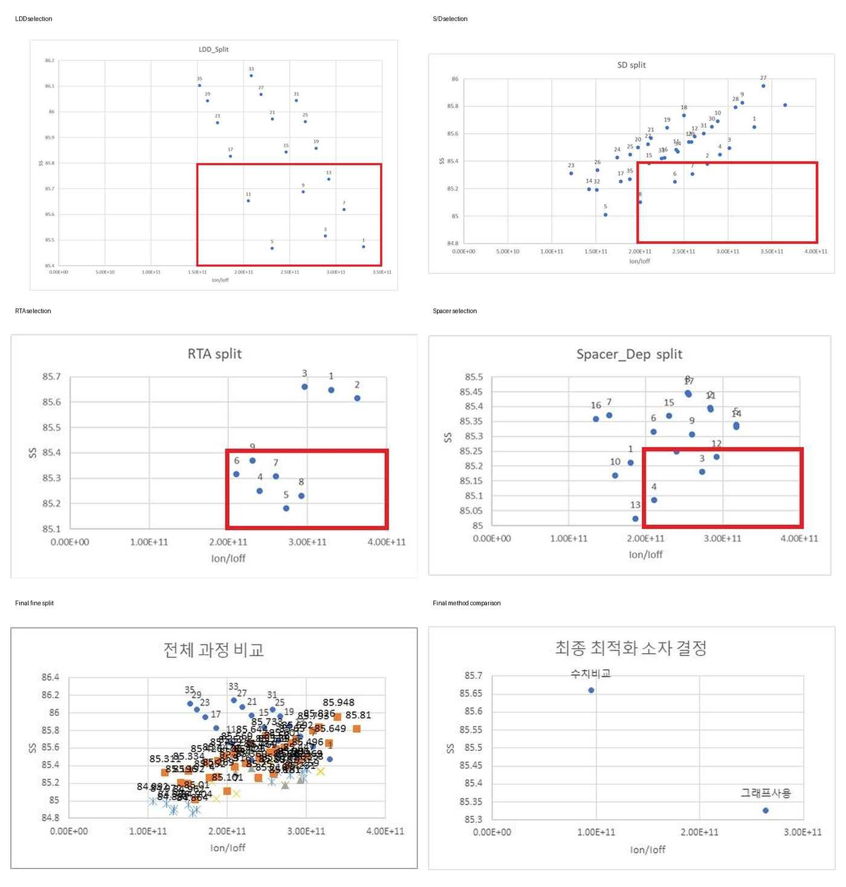

# P-type MOSFET Process Optimization using Sentaurus TCAD

기존 Sentaurus `SimpleMOS` nMOS 예제를 **pMOS 공정으로 변환**하고, LDD, Source/Drain, RTA, Spacer 조건을 조정해 전기적 특성을 최적화한 프로젝트입니다.

SProcess, SDevice, SVisual의 command를 직접 수정했으며, 최적화 방법도 다음 두 방식으로 비교했습니다.

1. `Ion`, `Ioff`, `SS`, `Vtgm` 수치와 증감률을 단계적으로 비교하는 방법
2. `Ion/Ioff-SS` 분산 그래프에서 우수 후보를 선택하는 방법

최종적으로 두 번째 방법에서 선택한 조건이 **Ion 목표를 만족하면서 Ioff와 SS를 더 낮게 유지**해 최종 소자로 선정되었습니다.

**Summary:**  
This project converts a Sentaurus SimpleMOS nMOS example into a pMOS process and compares numerical and `Ion/Ioff-SS` plot-based optimization methods. The final condition was selected for its balanced drive current, leakage, and subthreshold performance.

---

## Results at a Glance

| Item | Final Result |
|---|---:|
| Final method | `Ion/Ioff-SS` plot-based selection |
| LDD | `3e13 cm^-2`, 3 keV |
| Source/Drain | `5e16 cm^-2`, 10 keV |
| RTA | 3 s at 1000 C |
| Spacer_Dep | 0.30 |
| Ion | `1.35e-04 A/um` |
| Ioff | `4.93e-16 A/um` |
| SS | 85.181 mV/dec |
| Vtgm | -1.1421 V |



---

## What Was Implemented

- PWell/Boron 기반 nMOS 초기 구조를 NWell/Phosphorus 기반 pMOS 구조로 변경
- Arsenic/Phosphorus implant를 BF2 기반 LDD 및 p+ Source/Drain implant로 변경
- `LDD_E`, `SD_Dose`, `SD_E`, `RTA`, `Spacer_Dep` parameter 추가
- pMOS용 음전압 gate/drain sweep 구성
- pMOS drain current 절대값 처리
- `Vtgm`, `Id`, `SS`, `gm`, `Ion`, `Ioff`, 실제 추출 gate voltage 자동 출력
- 13개 TDR checkpoint를 이용한 공정 구조 확인
- 두 가지 최적화 방법 비교 및 최종 조건 선정

---

## Read the Project

| Page | Description |
|---|---|
| [Project Page](https://jujushmaterial.github.io/sentaurus-pmos-process-optimization/) | 프로젝트 목적, 구현 내용, 최종 결과를 한눈에 확인 |
| [Detailed Navigation](./guide/00_navigation.md) | 모든 과정 문서와 source code 안내 |
| [nMOS-to-pMOS Conversion](./guide/02_process_implementation.md) | 공정 극성과 바이어스를 바꾼 이유 |
| [SProcess Implementation](./guide/02_process_implementation.md) | well, implant, RTA, spacer, TDR command |
| [SDevice Bias Setup](./guide/03_device_and_extraction.md) | pMOS bias와 sweep 설정 |
| [SVisual Extraction](./guide/03_device_and_extraction.md) | 전류 절대값 처리와 Ion/Ioff 추출 코드 |
| [Optimization Method 1](./guide/05_numerical_optimization.md) | 수치 비교 기반 단계적 최적화 |
| [Optimization Method 2](./guide/06_plot_optimization_and_final.md) | `Ion/Ioff-SS` 그래프 기반 최적화 |
| [Final Results](./guide/06_plot_optimization_and_final.md) | 두 방법 비교와 최종 소자 |
| [Public Report](./report/pmos_process_optimization_report.pdf) | 개인정보 제거 최종 보고서 |

---

## Source Code

| File | Description |
|---|---|
| [`source/sprocess/pmos_process_modifications.cmd`](./source/sprocess/pmos_process_modifications.cmd) | 보고서에서 변경한 SProcess 핵심 command |
| [`source/sprocess/tdr_checkpoints.cmd`](./source/sprocess/tdr_checkpoints.cmd) | 13단계 TDR 저장 command |
| [`source/sdevice/pmos_bias_sweep.cmd`](./source/sdevice/pmos_bias_sweep.cmd) | pMOS drain/gate sweep 설정 |
| [`source/svisual/pmos_metric_extraction.tcl`](./source/svisual/pmos_metric_extraction.tcl) | pMOS 전류 처리와 성능 지표 자동 추출 |
| [`source/coursework/tdr_checkpoint_example.cmd`](./source/coursework/tdr_checkpoint_example.cmd) | 선행 실습에서 사용한 TDR 저장 예시 |

> `source/`의 코드는 최종 보고서에 제시된 수정·추출 command를 정리한 것입니다. 전체 원본 프로젝트 파일이 확보되면 같은 폴더에 추가할 수 있습니다.

---

## Repository Structure

```text
sentaurus-pmos-process-optimization/
├── README.md
├── index.md
├── guide/
│   ├── 00_navigation.md
│   ├── 01_project_overview.md
│   ├── 02_process_implementation.md
│   ├── 03_device_and_extraction.md
│   ├── 04_process_flow.md
│   ├── 05_numerical_optimization.md
│   ├── 06_plot_optimization_and_final.md
│   └── 07_limitations.md
├── figures/
│   └── actual/
├── source/
│   ├── coursework/
│   ├── sprocess/
│   ├── sdevice/
│   └── svisual/
├── results/
│   └── final_results.csv
└── report/
    └── pmos_process_optimization_report.pdf
```
