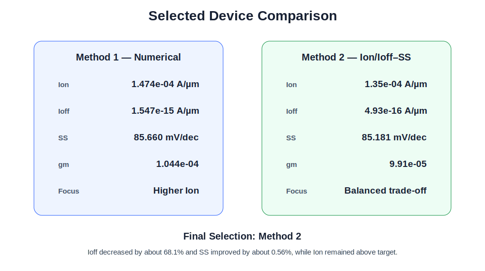

# 11. Optimization Method Comparison

## Selected Devices

| Metric | Numerical Method | Plot-Based Method |
|---|---:|---:|
| Ion | `1.474e-04` | `1.35e-04` |
| Ioff | `1.547e-15` | `4.93e-16` |
| SS | 85.660 | 85.181 |
| gm | `1.044e-04` | `9.91e-05` |

## Comparison

Compared with the numerical-method device, the plot-based device showed:

- Ion: about 9.2% lower
- gm: about 5.3% lower
- Ioff: about 68.1% lower
- SS: about 0.56% lower

The plot-based condition was selected because the leakage reduction was large while Ion remained above the target.

## Method Characteristics

| Method | Strength | Limitation |
|---|---|---|
| Numerical comparison | Clear metric-by-metric comparison | Harder to judge multi-metric trade-offs |
| Ion/Ioff–SS plot | Direct visualization of trade-offs | Depends on plot scale and candidate region |

**Summary:**  
The plot-based method selected the more balanced device despite a moderate Ion reduction.
