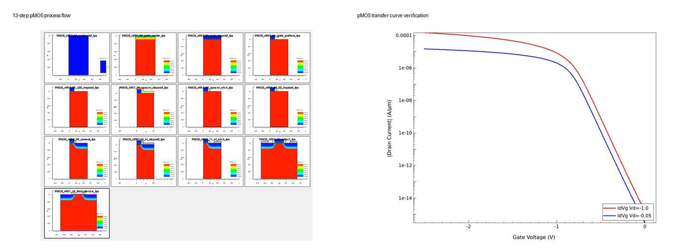

# 07. Process Flow Visualization

## 이 단계의 목적

| Item | Description |
|---|---|
| Purpose | 최종 pMOS가 의도한 공정 순서로 형성되는지 구조적으로 검증 |
| Method | SProcess 공정 직후마다 TDR 저장 |
| Output | 13개 checkpoint와 최종 대칭 구조 |

## Checkpoints

| Step | TDR Name | Structure Check |
|---:|---|---|
| 1 | `PMOS_n@node@_01_wafer_init` | wafer/NWell initialization |
| 2 | `PMOS_n@node@_02_gate_oxide` | gate oxide |
| 3 | `PMOS_n@node@_03_poly_deposit` | poly deposition |
| 4 | `PMOS_n@node@_04_gate_pattern` | gate patterning |
| 5 | `PMOS_n@node@_05_LDD_implant` | p-type LDD |
| 6 | `PMOS_n@node@_06_spacer_deposit` | nitride deposition |
| 7 | `PMOS_n@node@_07_spacer_etch` | sidewall spacer |
| 8 | `PMOS_n@node@_08_SD_implant` | p+ Source/Drain |
| 9 | `PMOS_n@node@_09_anneal` | activation and diffusion |
| 10 | `PMOS_n@node@_10_Al_deposit` | Al deposition |
| 11 | `PMOS_n@node@_11_Al_etch` | Al patterning |
| 12 | `PMOS_n@node@_12_reflect` | symmetric full structure |
| 13 | `PMOS_n@node@_13_final_device` | contact-defined final device |

## Why This Was Necessary

전기적 결과만 보면 implant 영역의 형성 위치나 spacer 잔류 여부를 확인하기 어렵습니다. TDR checkpoint를 통해 다음 오류 가능성을 점검했습니다.

- gate oxide/poly pattern 형성 오류
- LDD와 Source/Drain 위치 오류
- spacer 두께 변경 시 과식각 또는 잔류
- anneal 이후 junction diffusion
- reflect/contact 이후 최종 구조 완성 여부

[Complete TDR command list](../source/sprocess/tdr_checkpoints.cmd)

**Summary:**  
Thirteen TDR checkpoints were used to validate the physical process sequence before interpreting the electrical results.
