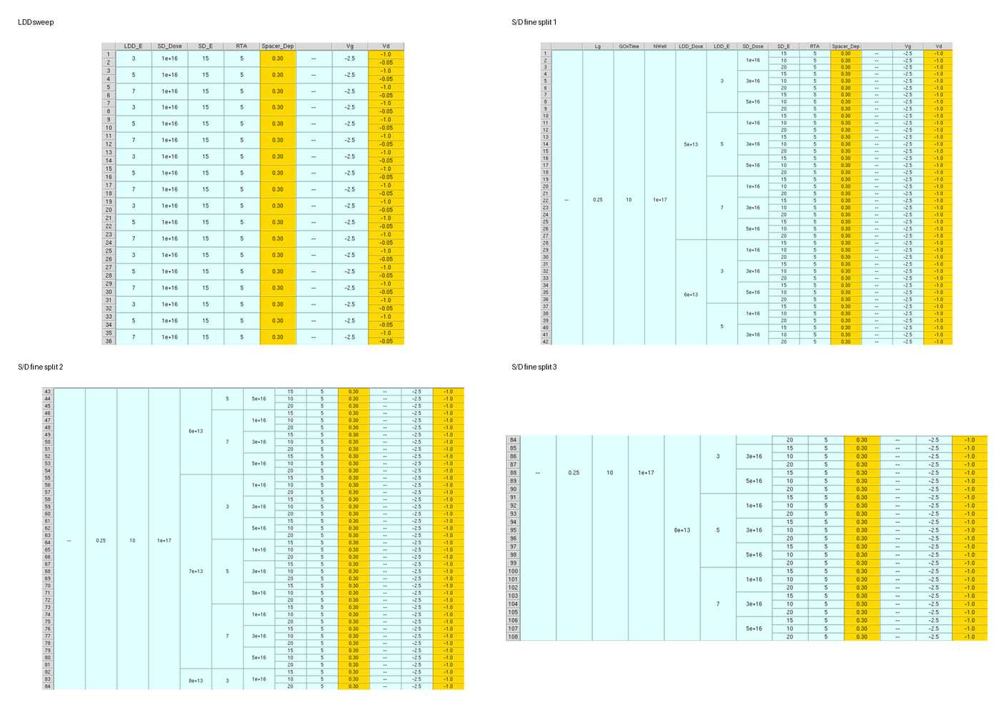

# 08. Optimization Targets and Strategy

## 이 단계의 목적

| Item | Description |
|---|---|
| Purpose | 공정 parameter의 역할을 해석하면서 성능 target을 만족하는 조건 탐색 |
| Metrics | Ion, Ioff, SS, Vtgm, gm, Ion/Ioff |
| Methods | numerical comparison and plot-based selection |

## Fixed Conditions

| Parameter | Value |
|---|---:|
| Lg | 0.25 |
| GOxTime | 10 |
| NWell | `1e17 cm^-3` |
| Vg | 0 to -2.5 V |
| Vd | -0.05, -1.0 V |

## Split Variables

| Variable | Main Range | Physical Role |
|---|---|---|
| LDD_Dose | `3e13-8e13 cm^-2` | extension resistance and drain field |
| LDD_E | 3, 5, 7 keV | LDD depth |
| SD_Dose | `1e16-5e16 cm^-2` and fine splits | p+ resistance and junction field |
| SD_E | 10-23 keV | Source/Drain depth |
| RTA | 3, 5, 7 s | activation and diffusion |
| Spacer_Dep | 0.25, 0.30, 0.35 | channel-S/D spacing and field |

## Why Sequential Optimization Was Used

모든 조합을 동시에 계산하면 global optimum 탐색에는 유리하지만 경우의 수가 크게 증가하고, 어떤 parameter가 성능 변화의 원인인지 해석하기 어렵습니다. 따라서 먼저 각 변수의 주효과를 파악하고 후보를 줄인 후 미세 split을 진행했습니다.

이 방식은 해석에는 유리하지만, 초기 단계에서 제외한 조건이 다른 parameter와 결합했을 때 더 좋아질 가능성이 있어 global optimum을 보장하지는 않습니다.

## Two Selection Methods

| Method | Decision Rule | Advantage | Limitation |
|---|---|---|---|
| Numerical | metric별 값과 증감률 비교 | 변화량을 정량적으로 확인 | trade-off 판단이 복잡함 |
| Plot-based | `Ion/Ioff`-`SS` 위치 비교 | 후보 분포와 균형을 직관적으로 확인 | 축 범위와 겹치는 점에 주의 필요 |

**Summary:**  
The strategy uses sequential splits for interpretability and compares numerical and multi-objective graphical selection methods.

---

# 09. Method 1 - Numerical Optimization

## 이 방법의 개요

| Item | Description |
|---|---|
| Selection | Ion 증가, Ioff 감소, SS 감소를 수치와 변화율로 비교 |
| Sequence | LDD -> RTA -> Source/Drain -> Spacer -> Fine Split x3 |
| Result | high-Ion practical candidate |

## 1. Baseline and LDD Split

초기 `LDD_Dose = 1e14` 조건은 Ioff와 SS가 target을 만족하지 못했습니다. Dose를 낮추고 energy를 3, 5, 7 keV로 분리해 비교했습니다.

```text
LDD_Dose = 3e13, 4e13, 5e13, 6e13, 7e13, 8e13
LDD_E    = 3, 5, 7 keV
```



- 3 keV: leakage가 매우 낮지만 Ion이 상대적으로 낮음
- 7 keV: target 범위 안에서 Ion이 가장 큰 경향
- 수치 비교 방식에서는 Ion 확보를 중시해 `LDD_E = 7`과 `LDD_Dose = 6e13-8e13` 후보를 유지

이 단계에서 낮은 dose 후보를 제외한 판단은 Method 2에서 다시 검토했습니다.

## 2. RTA Split

```text
RTA = 3, 5, 7 s
```

- 짧은 RTA: activation이 부족할 수 있음
- 긴 RTA: junction diffusion과 leakage가 증가할 수 있음
- 수치 비교에서는 RTA = 5 s를 다음 단계 기준으로 사용

## 3. Source/Drain Split

```text
SD_Dose = 1e16, 2e16, 5e16 cm^-2
SD_E    = 10, 15, 20 keV
```


- `SD_Dose = 1e16`: leakage는 양호하지만 Ion 확보가 불리
- `2e16`, `5e16`: Ion 증가와 target 유지
- `SD_E = 20`: 초기 탐색에서 가장 높은 Ion을 보이는 경향

## 4. Spacer Split

```text
Spacer_Dep = 0.25, 0.30, 0.35
```

- thin spacer: series resistance 감소와 Ion 증가, leakage 증가 가능
- thick spacer: drain field 완화, Ion 감소 가능
- 수치 비교에서는 `Spacer_Dep = 0.25`를 선택

## 5. Fine Split

### Fine Split 1

```text
SD_Dose = 4e16, 5e16, 6e16
SD_E    = 18, 20, 22 keV
```


### Fine Split 2

```text
SD_Dose = 4.5e16, 5.0e16, 5.5e16
SD_E    = 21, 22, 23 keV
```

### Fine Split 3

```text
SD_Dose = 3.8e16, 4.2e16, 4.6e16
SD_E    = 22, 22.5, 23 keV
```


## Selected Device

| Parameter | Value |
|---|---:|
| LDD_Dose / LDD_E | `7e13` / 7 keV |
| SD_Dose / SD_E | `4e16` / 23 keV |
| RTA | 5 s |
| Spacer_Dep | 0.25 |
| Ion | `1.474e-04 A/um` |
| Ioff | `1.547e-15 A/um` |
| SS | 85.660 mV/dec |

이 조건은 높은 Ion을 확보했지만, 여러 지표를 분리해 비교한 결과이므로 전체 trade-off를 한눈에 평가하기 어려웠습니다.

**Summary:**  
The numerical method produced a high-drive-current candidate through sequential filtering and three source/drain fine splits.
